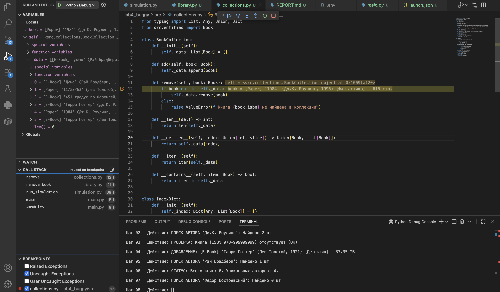
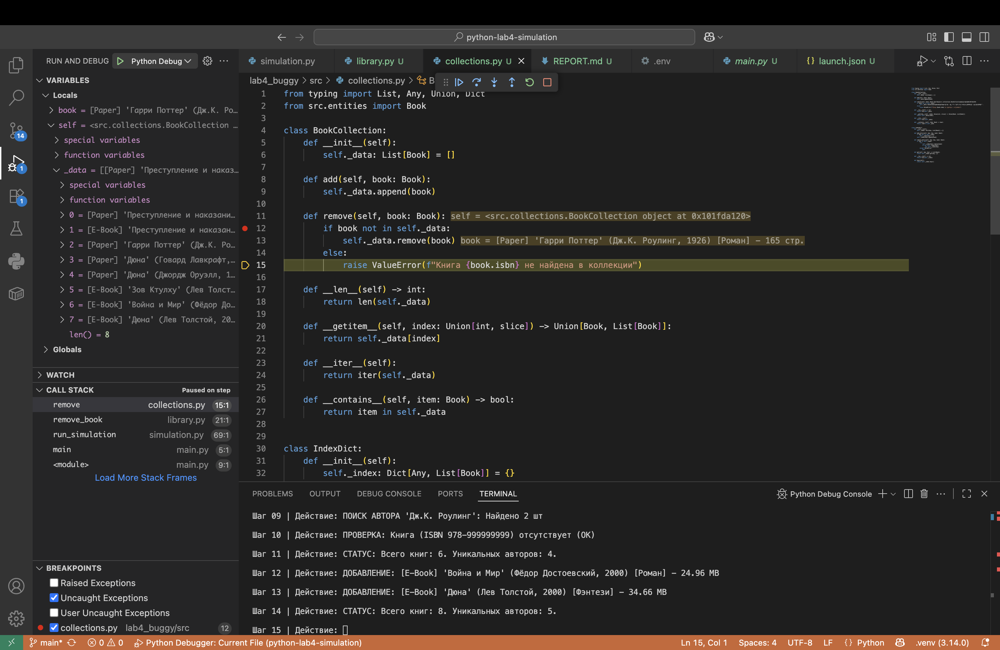
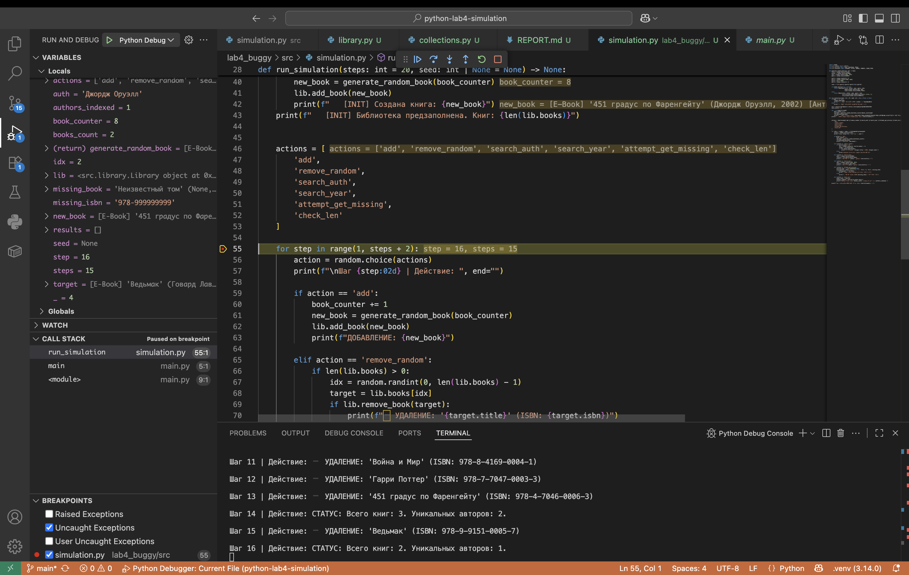
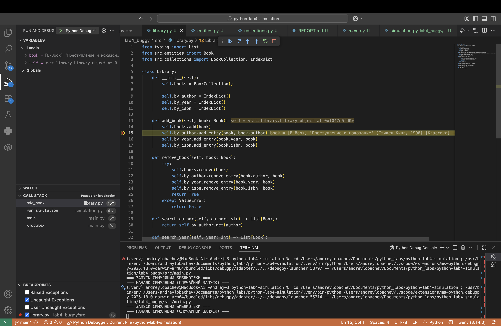
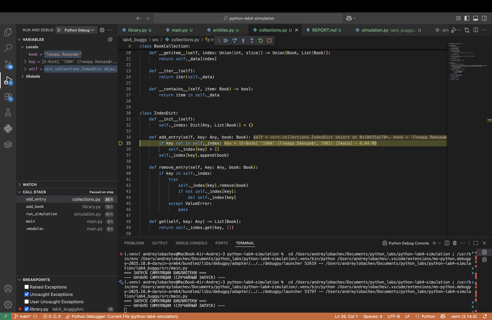
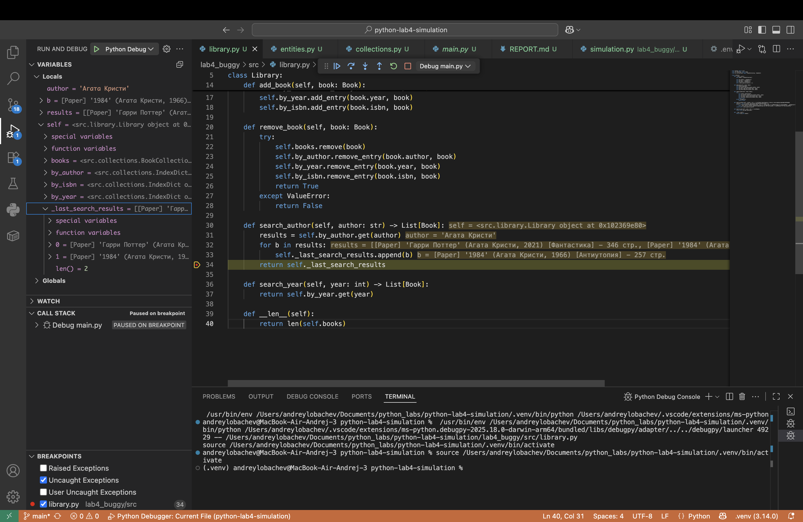
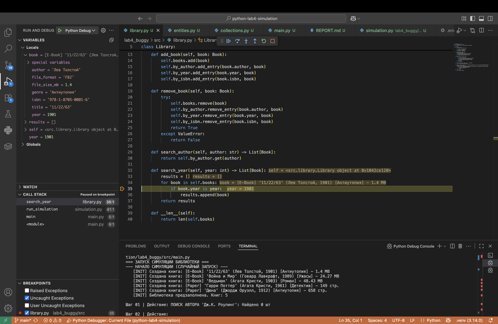

### Ошибка 1 — неверное логическое условие

**Место:** `collections.py`, метод `remove` класса BookCollection.

**Симптом:** При попытке удалить случайную книгу через действие remove_random симуляция завершается ошибкой `ValueError`: Книга [ISBN] не найдена в коллекции, хотя книга присутствует в библиотеке, что видно по скриншотам.

**Как воспроизвести:** Запустить симуляцию из папки `lab4_buggy`. При первом же событии удаления сработает исключение.

**Отладка:** Установлен breakpoint на условии if. В отладчике в панели Variables видно, что объект book содержится в списке `self._data`. Но из-за использования неправильного условия с "not in" выражение вычисляется как True, и программа переходит к генерации ошибки вместо удаления.

**Причина:** Использовано неверное логическое условие (not in вместо in).

**Исправление:** Заменено на: 
```python
if book in self._data:
```

**Проверка:** После исправления удаление книг проходит успешно, счетчик книг в библиотеке уменьшается корректно, симуляция не прерывается.

**Доказательства:** 


---


---

### Ошибка 2 — ошибка границы цикла 

**Место:** `simulation.py`, функция `run_simulation`.

**Симптом:**
Симуляция выполняет лишнее действие. Вместо заданных 15 шагов (значение, переданное из `main.py`) программа выполняет 16 итераций, что приводит к избыточному выводу в консоль и нарушению логики предела цикла.

**Как воспроизвести:**
Запустить симуляцию через файл `main.py`. В консоли в конце работы появится блок логов для «Шаг 16», хотя в условиях указано 15.

**Отладка:**
Был установлен breakpoint на заголовке цикла `for`. С помощью панели отладчика Variables отслеживалось изменение значения переменной `step`. После того как `step` достиг значения 15, цикл не завершился, а перешел к итерации 16. В строке при отладке это также видно: `step = 16, steps = 15`.

**Причина:**
Некорректно указана верхняя граница в функции `range()`. В Python второй аргумент функции `range` не включается в диапазон. Для выполнения 15 шагов требуется значение `steps + 1`, однако в коде ошибочно указано `steps + 2`.

**Исправление:** Заменено на: 
```python
for step in range(1, steps + 1):
```

**Проверка:**
Симуляция корректно завершается ровно после 15-го шага. Лишние действия в терминале отсутствуют.

**Доказательства:**



---

### Ошибка 3 — перепутанные аргументы

**Место:** `library.py`, метод `add_book`.

**Симптом:**
Программа работает без видимых падений, однако поиск по автору (`search_author`) не возвращает никаких результатов, даже если автор указан верно. Индекс авторов заполняется некорректно.

**Как воспроизвести:** В файле `library.py` в методе `add_book` изменить строку:
`self.by_author.add_entry(book.author, book)`, поменяв местами ключ и значение.

**Отладка:**
Был установлен breakpoint на строке 15 в файле `library.py`. При запуске отладки выполнение остановилось на этапе добавления первой книги («Дона»).

* **В панели Variables (Locals)**: Видно, что переменная `book` содержит объект класса `Book`.
* **Шаг внутрь**: При переходе внутрь метода `add_entry` видно, что в качестве ключа передается весь объект `Book`, а в качестве значения  — строка с именем автора.


**Причина:**
Перепутан порядок следования аргументов при вызове метода индексации.

**Исправление:**
Заменено на:

```python
self.by_author.add_entry(book.author, book)

```

**Проверка:**
После исправления в панели **Variables** видно, что ключом является автор, а значением — книги. Поиск по автору начал возвращать корректные данные.

**Доказательства:**


---


---

### Ошибка 4 — ошибка состояния (переменная не сбрасывается)

**Место:** `library.py`, метод `search_author`.

**Симптом:**
Метод поиска по автору работает некорректно: при каждом новом вызове в результаты попадают книги из предыдущих поисковых запросов. Список накапливает данные, и пользователю возвращается смесь из текущих и старых результатов.

**Как воспроизвести:**

Симуляция запускает поиск по автору «Агата Кристи» несколько раз подряд.

1. При первом поиске всё работает верно.

2. При втором и последующих вызовах список результатов возвращает книги, которые были найдены в прошлые разы, дублируя их или добавляя к ним новые.

**Отладка:**
Для анализа был установлен breakpoint на строке `return self._last_search_results` (строка 34 на скриншоте).

* **В панели Variables**: Видно, что локальная переменная `results` содержит только книги текущего автора («Агата Кристи»).
* **Далее**: Замечено, что книги добавляются в атрибут экземпляра класса `self._last_search_results` через `.append(b)`.
* **Проблема**: На скриншоте отчетливо видно, что список `_last_search_results` уже содержит 2 элемента перед началом возврата. Поскольку этот список не очищается в начале метода, данные от разных вызовов суммируются.

**Причина:**
Использование глобального (в рамках объекта) хранилища для временных результатов без процесса обнуления перед началом нового цикла поиска.

**Исправление:**

```python
def __init__(self):
        self.books = BookCollection()
        
        self.by_author = IndexDict()
        self.by_year = IndexDict()
        self.by_isbn = IndexDict()
        # Убрать self._last_search_results = []
        self._last_search_results = []
```
```python
def search_author(self, author: str) -> List[Book]:
    # Убрать использование self._last_search_results
    return self.by_author.get(author)

```


**Доказательства:**



---

### Ошибка 5 — сравнение через `is` вместо `==`

**Место:** `library.py`, метод `search_year`, строка 35.

**Симптом:**
Система поиска по году не находит книги, даже когда искомый год полностью совпадает с годом издания книги. Метод возвращает пустой список `[]`, игнорируя существующие данные.

**Как воспроизвести:**

1. Добавить в библиотеку книгу, и её год будет 1901, как на скрине.
2. Запустить поиск по этому же году.
3. Наблюдать, как программа проходит мимо условия совпадения.

**Отладка:**
Выполнение остановлено на строке 35 (`if book.year is year:`).

* **В панели Variables**: Мы видим, что искомая переменная `year` равна **1901**.
* **В текущем объекте**: Текущая книга в итерации `book`  её поле `year` также равно **1901**.
* **Проблема**: Несмотря на визуальное равенство значений (**1901 == 1901**), дебаггер показывает, что программа не заходит в блок `results.append(book)`. При попытке выполнить проверку `book.year is year` в консоли отладки, возвращает `false`. Это происходит потому, что числа в Python являются объектами, и для значений вне диапазона кэширования малых целых чисел оператор `is` проверяет, являются ли они одним и тем же объектом в памяти, а не равны ли они по значению.

**Причина:**
Использование оператора идентичности `is` вместо оператора сравнения `==` для проверки числовых значений.

**Исправление:** Заменено на:
```python
if book.year == year:
```

**Доказательства:**


---

